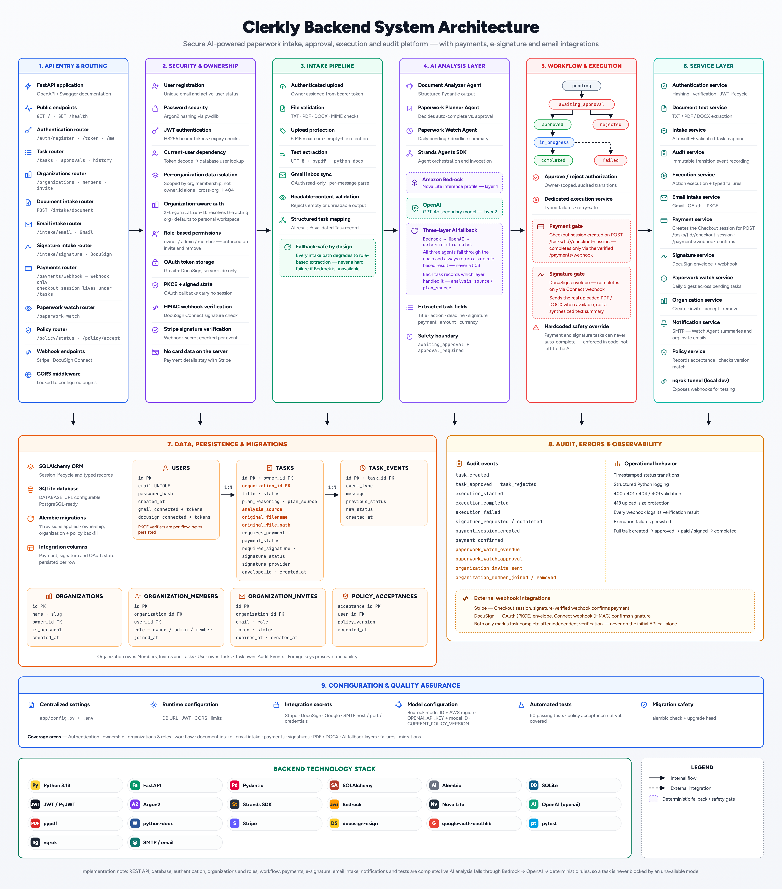
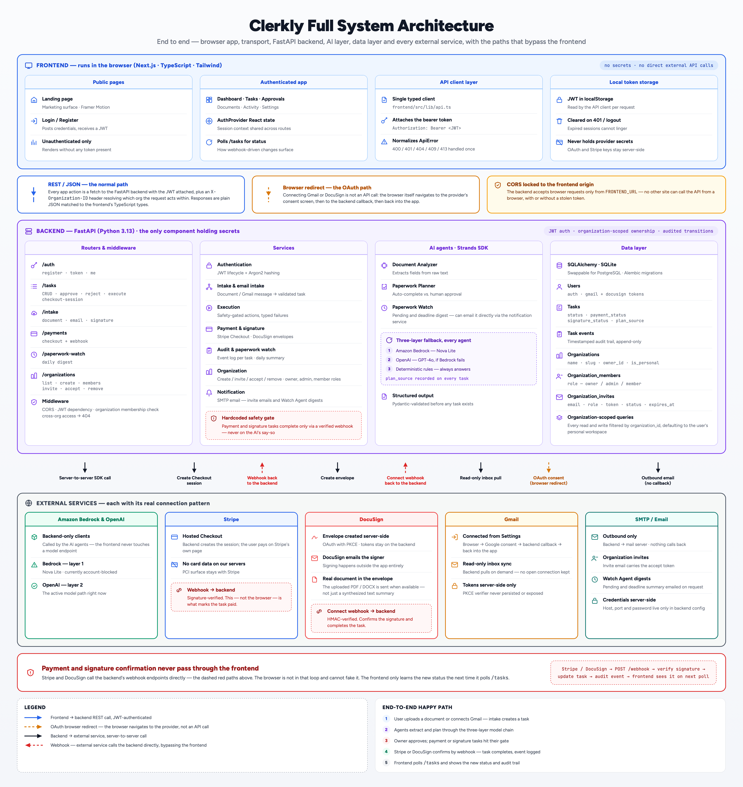
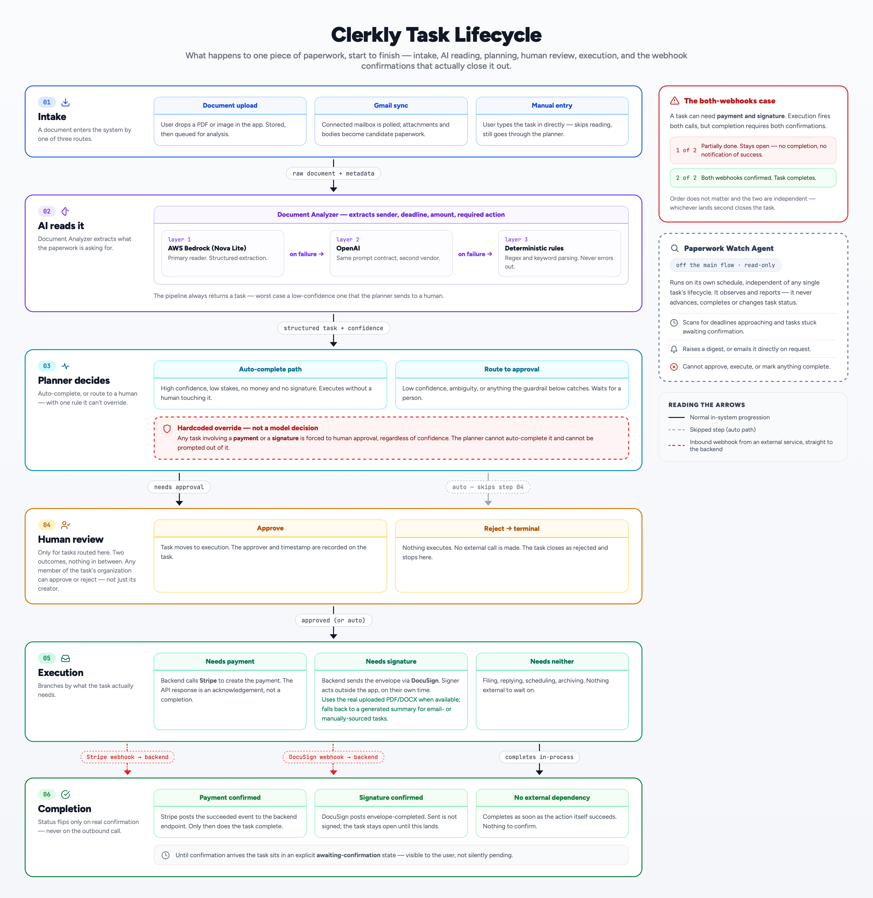

# Clerkly — AI-Powered Paperwork Agent

Clerkly is an AI agent that reads, understands, and acts on everyday paperwork — documents, emails, payments, and signatures — so people spend less time on administrative busywork.

Built for the **AWS "Agents for Humans" Hackathon** (Everyday Agents track), using the **Strands Agents SDK**, **Amazon Bedrock**, and **OpenAI**.

---

## The problem

Everyday paperwork — renewals, contracts, invoices, registrations — is scattered across email, PDFs, and physical documents. People have to manually read each one, figure out what needs to happen, track deadlines, and follow through. It's tedious and easy to get wrong.

## What Clerkly does

Clerkly takes paperwork in from three sources — a direct document upload, a connected Gmail inbox, or a manually created task — and runs it through a small pipeline of AI agents that:

1. **Read and understand** the document (what it is, key dates, amounts, required actions)
2. **Decide what to do next** — some tasks can be handled automatically, others need a human to approve first
3. **Execute the action** — complete a payment via Stripe, send a document for e-signature via DocuSign, or simply mark the task done
4. **Keep a daily watch** on anything still pending, so nothing slips through a deadline — and can email that summary directly on request

Every step is logged in an audit trail, and anything involving money or a legal signature always requires human approval before it can complete — that rule is enforced in code, not just prompted to the AI.

Paperwork and tasks live inside a **workspace (organization)**, not tied to a single account — every new signup gets a personal workspace automatically, and other people can be invited into it by email, with an owner/admin/member role model.

---

## Architecture

Clerkly runs three real agents built with the **Strands Agents SDK**:

| Agent | Job |
|---|---|
| **Document Analyzer** | Extracts title, deadline, required action, and payment/signature flags from an uploaded document or email |
| **Paperwork Planner** | Decides whether a task can auto-complete or must be routed to human approval, and records its reasoning |
| **Paperwork Watch Agent** | Runs a daily summary of pending tasks and upcoming deadlines |

**Every agent runs a three-layer AI fallback:**
1. **Amazon Bedrock (Nova Lite)** — the primary model
2. **OpenAI (GPT-4o)** — tried automatically if Bedrock is unreachable
3. **Deterministic rule-based extraction** — a last-resort safety net if neither AI provider responds

Each task records which layer actually handled it (`analysis_source` / `plan_source`: `"strands"`, `"openai_fallback"`, or `"deterministic_fallback"`), so it's always clear whether a result came from real AI or the fallback logic.

**Safety by design, not by prompt:** a hardcoded check in the execution layer blocks any task requiring payment or signature from completing without explicit human approval first, regardless of what any agent — or which AI provider — decides. This can't be bypassed by a prompt or a model output.

**Multi-user by design:** every task, document, and approval belongs to an organization, not an individual account. Access is scoped by organization membership — a member can see and approve any task in their org, cross-org access returns 404 the same way cross-user access always has. Inviting, removing, and role-based permission checks (owner/admin/member) are all enforced server-side, not just hidden in the UI.

### Diagrams

#### Backend architecture



Breaks the backend into its functional layers: API routing, security and ownership, the intake pipeline, the AI analysis layer, workflow and execution, the service layer (including organization management and email notifications), the data layer, and audit/observability.

#### Full system architecture



Shows the whole system — frontend, backend, and every external service — and distinguishes three kinds of connections: REST calls, OAuth browser redirects, and webhooks. The key insight: payment and signature confirmation never route through the frontend at all.

#### Task workflow



Traces a single piece of paperwork from intake through AI analysis, planning, human review, execution, and completion, including the hardcoded safety override and the Paperwork Watch Agent running independently on its own schedule.

---

## Tech stack

**Backend:** FastAPI · SQLAlchemy · SQLite · Alembic · JWT auth (pwdlib/Argon2) · Strands Agents SDK · Amazon Bedrock · OpenAI

**Integrations:** Stripe (payments) · DocuSign eSignature (sandbox, real signing flow) · Gmail API (OAuth, email intake) · SMTP (invite and digest emails)

**Frontend:** Next.js · Tailwind CSS · Framer Motion

---

## Getting started — backend setup, step by step

### 1. Clone the repo and enter the backend folder
```bash
git clone https://github.com/yasmeenmh90-beep/Clerkly.git
cd Clerkly/backend
```

### 2. Create and activate a virtual environment
```bash
python3 -m venv ../venv
source ../venv/bin/activate
```

### 3. Install dependencies
```bash
pip install -r requirements.txt
```

### 4. Set up environment variables
Copy the example file and fill in your own values:
```bash
cp .env.example .env
```
You'll need:
- `JWT_SECRET_KEY` — any long random string
- `OPENAI_API_KEY` — for the second-layer AI fallback (platform.openai.com)
- `GOOGLE_CLIENT_ID` / `GOOGLE_CLIENT_SECRET` / `GOOGLE_REDIRECT_URI` — for Gmail intake (Google Cloud Console)
- `DOCUSIGN_INTEGRATION_KEY` / `DOCUSIGN_SECRET_KEY` / `DOCUSIGN_ACCOUNT_ID` / `DOCUSIGN_REDIRECT_URI` — for signature intake (DocuSign developer sandbox)
- `STRIPE_SECRET_KEY` / `STRIPE_WEBHOOK_SECRET` — for payments (Stripe dashboard, test mode)
- `SMTP_HOST` / `SMTP_PORT` / `SMTP_USERNAME` / `SMTP_PASSWORD` / `SMTP_FROM_EMAIL` — for organization invite emails and Paperwork Watch digest emails
- AWS credentials configured locally for Bedrock access (`aws configure` or SSO)

`OPENAI_API_KEY` and `SMTP_*` are both optional — without them, agents skip straight to the deterministic fallback, and invites/digests are still created but not automatically emailed.

### 5. Run database migrations
```bash
alembic upgrade head
```
This creates the SQLite database and applies every schema migration (users, tasks, OAuth token fields, payment tracking, signature tracking, AI source tracking, and organizations/organization members/invites). Every existing user is automatically given a personal organization as part of this migration; every new signup gets one automatically going forward.

### 6. Start the backend server
```bash
uvicorn app.main:app --reload
```
The API is now running at `http://127.0.0.1:8000`. Interactive docs are available at `http://127.0.0.1:8000/docs`.

### 7. (Optional) Forward webhooks for local testing
Stripe and DocuSign both need a public URL to send webhook events to your local machine:
```bash
# Stripe
stripe listen --forward-to localhost:8000/payments/webhook

# DocuSign (via ngrok, then register the URL in DocuSign's Connect settings)
ngrok http 8000
```

### 8. Run the test suite
```bash
pytest
```

---

## Running the frontend
```bash
cd ../frontend
npm install
npm run dev
```
The app runs at `http://localhost:3000`.

**Note:** the multi-user backend (organizations, invites, roles) is fully built and tested, but the corresponding frontend UI (organization switcher, members/invite page, accept-invite page) is in progress. Every existing page continues to work unchanged in the meantime, scoped to each user's personal workspace by default.

---

## What's actually working (tested end to end)

- Account registration and login (JWT), with an organization automatically created for every new user
- Manual task creation, approval, rejection, and execution
- Document upload → task creation, with real AI analysis via OpenAI fallback while Bedrock is blocked (see below)
- Real uploaded PDF/DOCX files sent to DocuSign for signature, not just a generated text summary
- Gmail connection and inbox sync into tasks
- Stripe payments — real Checkout session, real webhook, task auto-completes on payment
- DocuSign signatures — real OAuth connection, real envelope creation and email delivery, real signing, real webhook confirmation, task auto-completes on signature
- Paperwork Watch Agent — on-demand daily summary, with the option to email it directly via SMTP
- Organizations — every user gets a personal workspace; inviting, accepting, listing, and removing members all tested via real HTTP requests, with owner/admin/member permission checks enforced server-side
- Full audit trail of every task event, including which AI layer handled each analysis
- 50 automated backend tests passing

## Known limitations

**Amazon Bedrock is currently blocked at the account level** (`ValidationException: Operation not allowed`) — this affects both the Bedrock Playground and API calls, and is not something fixable in code. An AWS Support case is open and escalated. As a result, every agent currently falls through to its **OpenAI layer**, which handles document analysis and planning with real AI — Bedrock is the intended primary provider and works identically once AWS restores access. The deterministic rule-based layer only activates if both AI providers are unavailable. The rest of the system — task management, approvals, payments, signatures, and organizations — is unaffected and fully functional.

**Multi-user frontend UI is still in progress** — the backend fully supports organizations, invites, and roles (tested via the API), but the corresponding frontend pages are being built. Until then, every account behaves exactly as before, scoped to its own personal workspace.

---

## License

MIT — see [LICENSE](./LICENSE) for details.

## Team

Built by Yasmeen Azmat Ali (backend) and Pruthviraj (frontend/UI) for the AWS "Agents for Humans" Hackathon.
